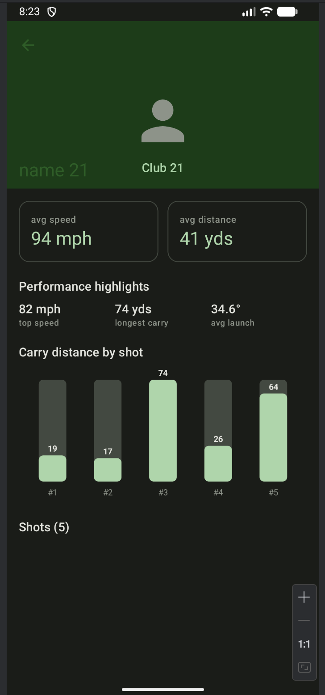

An offline-first Android app that displays golf players and their shot performance metrics.

The app fetches players and shots from a REST API, caches them locally with Room, and presents a searchable, 
paginated player list and a detailed per-player view with aggregate stats, a custom performance chart, 
and a list of individual shots. It works fully offline once data has been fetched.

# Features

* Paginated list of players (name, club, average ball speed), loaded from a REST API.
* Search/filter players by name or club, reactive and debounced.
* Player detail screen with profile, average stats, and derived highlights
  (top speed, longest carry, average launch angle).
* Per-shot metrics: ball speed, launch angle, carry distance, spin rate, club.
* Custom bar chart visualizing carry distance per shot.
* Offline-first: Room is the single source of truth; the network only refreshes
  the cache. Cached data is shown when offline, with a clear notice.
* Light and dark themes (Material 3).
* Entrance and stat count-up animations.
* State preserved across configuration changes.
* A Jetpack Compose version of the players list (bonus), reusing the same
  ViewModel and Paging stream.

# Tech stack

Concern              Choice                                               
---------------------|-----------------------------------------------------
Language            : Kotlin (Coroutines + Flow)                          
Architecture        : MVVM + Repository, Clean Architecture layers        
Dependency injection: Hilt                                                
Networking          : Retrofit2 + OkHttp                                  
JSON parsing        : Moshi (KSP codegen)                                 
Local persistence   : Room                                                
Pagination          : Paging 3 (Room-backed)                              
UI (primary)        : Android Views, Material 3, ViewBinding/DataBinding  
UI (bonus)          : Jetpack Compose + Material 3                        
Navigation          : Jetpack Navigation + Safe Args (single-activity)    
Image loading       : Glide (Views), Coil (Compose)                       
Testing             : JUnit, MockK, Turbine, coroutines-test, paging-testing, Compose UI test 

# Requirements

* Android Studio (recent stable release).
* JDK 17.
* Android SDK with compileSdk 36.
* An emulator or device running Android 7.0 (API 24) or higher.

No API keys are required; the mock API endpoint is public.

# Build and run

1.Clone the repository.

   `git clone https://github.com/ratnasrivastava/Rapsodo-Assignment.git
   cd GolfPerformanceTracker`

2.Open the project in Android Studio and let Gradle sync.

3.Select the `app` run configuration and run it on an emulator or device.
  Alternatively, from the command line:
   `./gradlew installDebug`
   

The Views-based UI is the default entry point (`MainActivity`). The Compose
players list is hosted separately in `ComposePlayersActivity` (see "Compose
version" below).

# Running tests

Unit tests (JVM, no device needed) cover mappers, the search use case, the
repository, and the players view model:

Run command - 
`./gradlew test`

Compose UI tests are instrumented and require an emulator or device:
Run Command
`./gradlew connectedDebugAndroidTest`

# API

Mock data is served from MockAPI:

`Base URL:  https://6a2b7b47b687a7d5cbc550e0.mockapi.io/api/v1/
Players:   GET /players   -> id, name, club, avgSpeed, avgDistance, imageUrl
Shots:     GET /shots     -> id, playerId, ballSpeed, launchAngle,
                             carryDistance, spinRate, clubType`

The base URL is configured via `BuildConfig.BASE_URL` in `app/build.gradle.kts`,
so it can change per build type without code edits.

Note on the mock data: MockAPI generates random `playerId` values that do not
line up with real player ids. The repository reconciles this by deterministically
assigning a stable set of shots to each player. With a production backend this
step would be unnecessary; the server's association would be trusted directly.

# Project structure

me.ratnasrivastava.golfperformancetracker
├── domain/                  # Pure Kotlin: models, repository interface, use cases
├── data/                    # Retrofit, Room, mappers, repository impl
│   ├── network/             #   API service + DTOs
│   ├── local/               #   Room database, DAOs, entities
│   ├── mapper/              #   DTO/entity <-> domain mappers
│   ├── repository/          #   Offline-first repository implementation
│   └── util/                #   DispatcherProvider
├── presentation/            # MVVM UI
│   ├── players/             #   Players list (Views): Fragment, ViewModel, adapter
│   ├── detail/              #   Player detail (Views) + custom chart usage
│   ├── compose/             #   Compose players list (bonus) + theme
│   └── common/              #   Shared view/animation helpers, custom chart view
└── di/                      # Hilt modules: Network, Database, Repository

# Compose version

A Jetpack Compose implementation of the players list is included as a bonus. It
reuses the same `PlayersViewModel`, use cases, and Paging stream as the Views
screen; only the UI layer differs. It is hosted in `ComposePlayersActivity`.

To view it, launch `ComposePlayersActivity` (temporarily move the
`MAIN`/`LAUNCHER` intent filter to it in the manifest)

# Possible enhancements

These were scoped as optional and can be added without changing the core
architecture:

* A **RemoteMediator** for true network pagination (the API supports **page/limit**).
* A Compose version of the detail screen.
* Splitting into Gradle modules (`:app`, `:data`, `:domain`); the package
  structure already mirrors these boundaries.
* Expanded instrumentation and end-to-end tests.

#DEMO

[]
[]

